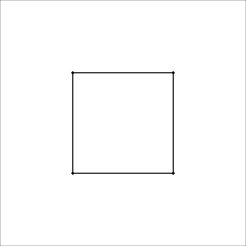

layout: false
class: split-75
background-image: url("plots/title_slide_bkg.png")
background-position: center
background-size: contain

<style type="text/css">
.remark-slide-content{
font-size: 30px;

}
code.r{
  font-size: 24px;
}

</style>

```{r setup, include=FALSE}
options(htmltools.dir.version = FALSE, width = 120)
library(tidyverse)
library(knitr)
library(tourr)
library(kableExtra)
library(htmltools)
opts_chunk$set(
  echo = TRUE, warning = FALSE, message = FALSE, comment = "#>",
  fig.path = 'figure/', cache.path = 'cache/', fig.align = 'center',
  fig.width = 12, fig.height = 4, fig.show = 'hold',
  cache = FALSE, external = TRUE, dev = 'png', dev.args = list(bg = "transparent")
)
mp4_vid <- function(src, width){
  HTML(
    paste0(
      '<video width="', width, '" loop autoplay>
        <source src="', src, '" type="video/mp4">
      </video>'
    )
  )
}
```


```{css, echo=FALSE}
/* custom.css */
:root{
  --main-color1: #509e2f;
  --main-color2: #bcbddc;
  --main-color3: #efedf5;
  --main-color4: #9DDAE5;
  --text-color3: black;
  --text-color4: #505050;
  --code-inline-color: #4e5054;
  --link-color: #006CAB;
}
.large { font-size: 150% }
.largeish { font-size: 120% }
.summarystyle { font-size: 150%;
  line-height:150%;}
.my-gray {color: #606060!important; }
.tiny{ font-size: 25%}
```


.column[.content[

<br>

## ** Tours for the dynamic visualization of high-dimensional data**

.my-gray[
.large[**Ursula Laa**]

.largeish[ Institute of Statistics <br>
University of Natural Resources and Life Sciences
]
]

JSM 2022, Washington DC

]]

.column[.top_abs.content[

]]

---
# The grand tour and hypercubes

With the grand tour we are using linear projections to visualize data in more than 3D - a nice way of visualizing the tour is to show it for hypercubes (generated with `geozoo`)

<br>

.center[
<div >
    <div style="width: 33%; float: left">
        <b> 3D </b>
        <a href="">

        </a>
    </div>
        <div style="width: 33%; float: left">
       <b>4D</b>
        <a href="">
        </a>
    </div>
    <div style="width: 33%; float: left">
        <b>6D</b>
        <a href="">
        </a>
    </div>
    </div>
]

---
class: split-40

.column.content[

<br>

# Implementation in R

<br>

```{r, echo=TRUE, warning=FALSE, message=FALSE, eval=FALSE}
library(tourr)
library(palmerpenguins)

penguins <- na.omit(penguins)
animate_xy(penguins[,3:6], 
           col=penguins$species, 
           axes="bottomleft", 
           fps=15)
```


```{r, echo=FALSE, warning=FALSE, message=FALSE, eval=FALSE}
set.seed(2021)
render_gif(penguins[,3:6], grand_tour(), 
           display_xy(col=penguins$species, axes="bottomleft"), 
           "plots/penguins2d.gif", frames=100, width=300, height=300)

```

]

.column.content[

]

---
# Short overview

Short history:

- First proposed in [Asimov (1985)](https://doi.org/10.1137/0906011)
- Lot of new developments in the 1990's, e.g. the guided tour [Cook et al (1995)](https://www.jstor.org/stable/1390844))
- R implementation in 2011 in the `tourr` package [Wickham et al (2011)](https://www.jstatsoft.org/article/view/v040i02)

Common usage:

- explore the shape of a multivariate distribution
- understand class differences and which variables are important
- identify (multivariate) outliers
- visualize statistical models, as described in [Wickham et al (2015)](https://doi.org/10.1002/sam.11271)

These and more recent developments were summarized in a recent review: [Lee et al (2021)](https://doi.org/10.1002/wics.1573)

---
# What is new?

Recent work has focused on two questions:

### How can we use tours in the case of **large data**?

- Large number of **observations**: overplotting can hide features, especially in the case of concave distributions.
- Large number of **variables**: projected data points tend to fall close to the center (crowding problem)

### Can we make tour displays interactive to learn more?

- Having **manual controls** of the projection allows the viewer to understand which variables are important, e.g. for separating groups.
- Leverage javascript interfaces, shiny apps, etc. to build an **interactive display**, e.g. for replaying or exporting projections, or for linked brushing

---
# Sage tour

When we project linearly from a high-dimensional space points start to **pile up** near the center of the projection, obscuring features or separation between groups. We can understand this as a large part of the high-D volume being projected onto a small area.

The sage display transforms the **radius** (i.e. the distance from the center) of all projected data points such that equal volume in the high-dimensional space gets projected onto equal area in the two-dimensional plane.

<center>

</center>

<center>
.footnote[[Laa, Cook, Lee (2022) Burning sage: Reversing the curse of dimensionality](https://doi.org/10.1080/10618600.2021.1963264)]
</center>


---
# Clustering and sage display

  


---
# Liminal

With high-dimensional data a common approach is to use non-linear dimension reduction like t-SNE, also here we can leverage the tour in a linked display:

<iframe title="Animation linking the tSNE plot with a tour plot, of data with 6 clusters, 2 really large, 3 very small and close together, and 1 close to the three but slightly bigger. tSNE spreads them into 6 clusters, three big and three small roughly equidistant." src="https://player.vimeo.com/video/439635905" width="80%" height="400" frameborder="0" allowfullscreen></iframe>

.footnote[[Lee, Cook, Laa (2022) Casting Multiple Shadows JDSSV](https://doi.org/10.52933/jdssv.v2i3)]

---
# The slice tour display

Even when projecting from relatively low number of dimensions we can still have overplotting issues if there are a lot of observations. When we have a lot of data there might be hidden features inside the distribution that are hidden in projections but visible when "slicing" through the distribution.

.center[]

.footnote[[Laa, Cook, Valencia (2020) A slice tour for finding hollowness in high-dimensional data](https://doi.org/10.1080/10618600.2020.1777140)]

---
# Slice tour of geometric shapes

We can combine the slice display with a grand tour to gain intuition about a surface.


.center[
<div >
    <div style="width: 33%; float: left">
        <b> 3D sphere </b>
        <a href="">

        </a>
    </div>
        <div style="width: 33%; float: left">
       <b>4D torus</b>
        <a href="">
        </a>
    </div>
    <div style="width: 33%; float: left">
        <b>Roman surface</b>
        <a href="">
        </a>
    </div>
    </div>
]

The slice tour is especially useful when looking at classification models using tools from the `classifly` package, and it also inspired work on "section pursuit".

---
# Manual tour in mathematica

With the slice tour understanding what we are looking at is becoming more difficult: we have to understand the projection the slice is based on, but also the center point that is anchoring where the slice is passing through the distribution. Here having **manual control** of both aspects is especially useful.

Ongoing work (with Alex Auman, Di Cook, German Valencia): we can implement such an interactive manual slice tour with tools available in mathematica, which has also motivated a new approach to manual tours.


---
# Interactivity

The `liminal` implementation shows what is possible already with current tools in R, and there are a lot of interesting developments that build on interfaces to Javascript for better interactive displays:

Hart and Wang (2022) [detourr:](https://cran.biotools.fr/web/packages/detourr/index.html) Animations for {tourr} using htmlwidgets for performance and portability. <br>

Harrison (2022) [Langevin dynamics based tours](https://logarithmic.net/langevitour/) of data, in Javascript with R wrapper. <br>

However there is no canonical approach that makes this *easy* for new users.

---
# Summary

- Tour methods can visualize high-dimensional data and reveal multivariate structure and outliers, and help us understand grouping
- The `tourr` package includes different methods for basis selection, an algorithm for geodesic interpolation and many display functions
- Since we rely on linear projections, tour displays are straightforward to interpret
- Tours can be used as a complementary method together with non-linear dimension reduction
- These methods can benefit from interactive interfaces, some recent efforts are available in `R` packages: `liminal`, `spinifex` 

